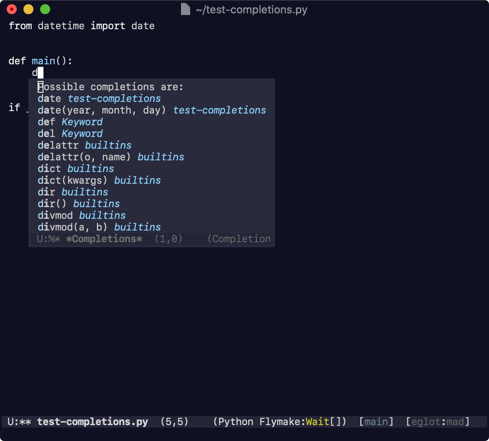

# emacs-completions-frame
Show completions buffer in child frame

## How it looks like

## Installation and usage

Download `completions-frame.el` and run:

<kbd>M-x</kbd> `package-install-file` <kbd>RET</kbd> `<path-to-completions-frame-el>` <kbd>RET</kbd>

<kbd>M-x</kbd> `completions-frame-mode` <kbd>RET</kbd>
